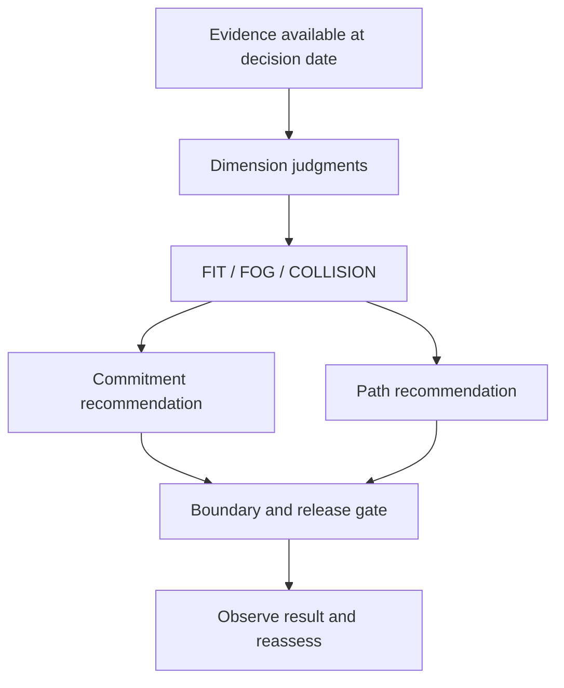

# StratOS v2: Product and Case-Study Specification

**Status:** Implementation-ready synthesis  
**Target:** [jeremycapps.com/stratos-v2](https://www.jeremycapps.com/stratos-v2)  
**Primary question:** Given what is known now, what is the largest commitment the organization can responsibly make next—and what must happen alongside it?

## 1. Executive decision

StratOS v2 should evolve from an inspectable constraint model into an operational commitment-judgment system.

The existing page explains:

- the organization as six coupled conversion systems;
- a shared constraint envelope of people, finance, time, and risk;
- calendar trajectory versus feasible trajectory; and
- an Author → Implement → Verify → Adjust cycle.

Those elements should remain. The missing layer is the answer to **“So what do we do?”**

Every StratOS evaluation should therefore produce:

1. a **verdict** about whether the requested commitment is supported by available evidence and capacity;
2. a **commitment recommendation** governing what happens to the commitment itself;
3. a **path recommendation** governing the intervention, correction, or learning path that accompanies the commitment;
4. a **boundary** defining how long, how far, or at what cost the recommendation remains authorized; and
5. a **reassessment rule** describing what evidence will authorize the next decision.

The two recommendations use the same six-operation grammar:

`START · END · CONTINUE · CHANGE · EXCEPTION · ESCALATE`

Their difference is not the verb. It is the object the verb operates on.

```text
Commitment: CHANGE(store-release cadence to zero)
Path:       CHANGE(rollout configuration)
```

The case studies then compare StratOS's authorized pair with the action actually taken and estimate how the alternative would have changed the next tranche of exposure. StratOS does not claim to predict success or failure. It tests whether the next irreversible commitment was justified by the evidence available at that decision date.

## 2. Product thesis

### 2.1 Problem

Strategy frameworks often stop at diagnosis. They show that a goal is attractive, risky, under-resourced, or uncertain, but do not translate that judgment into a bounded next operation.

Organizations consequently make commitments at a scale that exceeds:

- demonstrated operating capacity;
- the evidence supporting transferability;
- the time available for learning;
- acceptable financial or risk exposure; or
- the authority of the person making the decision.

The failure is not always the strategic goal. It is frequently the size, timing, configuration, or irreversibility of the next commitment.

### 2.2 Product claim

> **StratOS matches the size and irreversibility of the next commitment to the strength of the available evidence, organizational capacity, and decision authority.**

The operative question is not simply:

> Should we do this?

It is:

> **What is the largest commitment we can responsibly make next, and what path must accompany it?**

### 2.3 What the model does not claim

StratOS should not claim to:

- predict whether a strategy will ultimately succeed;
- prove that a historical counterfactual would have produced success;
- reduce every organizational judgment to a single score;
- treat missing public data as negative evidence;
- infer unlimited authorization from a local or small-scale `FIT` result; or
- treat `COLLISION` as an automatic instruction to stop.

## 3. Product architecture



The current six conversion systems remain the organizational substrate:

| Conversion system | Converts |
|---|---|
| Discernment | Signal into conviction and revised judgment |
| Invention | Knowledge into an adopted offering and reusable learning |
| Operations | Work into customer-visible flow and a corrected system |
| Execution | Assurance into bounded release, adoption, and operational learning |
| Advantage | Controlled capability into external value and economic evidence |
| Resource | Capacity into deployment, return, and renewed capacity |

The commitment-judgment layer evaluates whether those systems can collectively support the requested future configuration within the shared constraint envelope.

### 3.1 Reconciliation with Author → Implement → Verify → Adjust

The operation grammar groups into three binary pairs:

| Cycle role | Operators | Question |
|---|---|---|
| **Author** | `START / END` | Should this object exist? |
| **Implement** | `CONTINUE / CHANGE` | Is the current form producing acceptable movement? |
| **Verify** | `EXCEPTION / ESCALATE` | Can the condition be resolved under normal rules and current authority? |

`Adjust` remains the transition between cycles. It is the act of applying the two authorized operations, observing the result, and returning the new evidence to the next Author–Implement–Verify cycle. It does not require a fourth operator pair.

## 4. Evaluation model

### 4.1 Unit of analysis

The unit of analysis is a **bounded commitment request at a specific decision date**.

Each evaluation must identify:

- the goal or required future configuration;
- the requested next commitment;
- the decision date;
- the actor and their authority boundary;
- the current organizational state;
- the evidence available on that date;
- the irreversibility of the requested increment; and
- the next opportunity to reassess.

### 4.2 Capacity model

At minimum, StratOS compares capacity, existing commitments, and goal load across people, time, and finance.

| Dimension | Available | Already committed | Requested load |
|---|---|---|---|
| People | `capacity.people` | `committed.people` | `load.people` |
| Time | `capacity.time` | `committed.time` | `load.time` |
| Finance | `capacity.finance` | `committed.finance` | `load.finance` |

For dimension `d`:

```text
slack[d] = capacity[d] - committed[d] - load[d]
```

The prototype must also evaluate dimensions that are not adequately represented by fungible capacity arithmetic:

- operational readiness;
- customer or mission value;
- risk and irreversible exposure;
- transferability of a capability into the target context; and
- decision authority.

These dimensions use explicit thresholds, ranges, or acceptance conditions instead of forced numerical precision.

### 4.3 Evidence status

Every case-study input must carry one of four evidence labels:

| Label | Meaning | Permitted use |
|---|---|---|
| `OBSERVED` | Directly documented and available at the decision date | May determine the verdict |
| `ESTIMATED` | Calculated from contemporaneous documented facts | May determine the verdict if assumptions are shown |
| `FOG` | Decision-relevant value cannot be established from available evidence | Must remain unknown |
| `HINDSIGHT` | Became known only after the decision date | May explain the outcome but may not determine the retrodictive verdict |

Unknowns should block a commitment only when they are **material**:

> Could a plausible value for this unknown change the authorized next operation?

If no, the uncertainty is recorded but does not block. If yes, it is material `FOG`.

### 4.4 Irreversibility and evidence standard

The required evidence standard rises with the irreversibility of the next increment.

```text
evidence_required ∝ irreversibility(next_commitment)
```

A reversible pilot and a national rollout should not require or authorize the same evidentiary threshold. A smaller commitment may be authorized when the requested commitment is not.

### 4.5 Verdict semantics

| Verdict | Meaning | What it authorizes |
|---|---|---|
| `FIT` | The specific requested increment fits the demonstrated capacity, evidence, value, risk, and authority envelope | Commitment only up to the validated scale |
| `FOG` | Available evidence cannot justify or reject the requested increment | A bounded commitment or intervention that resolves material uncertainty without disproportionate exposure |
| `COLLISION` | The requested increment cannot fit under current conditions | A change to commitment, capacity, scope, configuration, ownership, authority, or—in terminal cases—continuation itself |

The aggregate verdict must expose its binding dimensions and causes. Dimensions should not be averaged into a score that conceals a single hard constraint.

## 5. The two-recommendation contract

Every evaluation returns exactly two recommendations.

### 5.1 Recommendation A: commitment

This operation acts on the commitment itself: its existence, continuation, scope, cadence, release rate, exception status, or authority.

### 5.2 Recommendation B: path

This operation acts on the corrective or enabling path: validation, capacity building, remediation, operating configuration, prerequisite, ownership, exception handling, or escalation.

### 5.3 Shared operation grammar

| Operation | General meaning |
|---|---|
| `START` | Create or initiate an object that does not yet exist |
| `END` | Terminate or unwind an object |
| `CONTINUE` | Maintain an existing object in its current authorized form |
| `CHANGE` | Alter an existing object's scope, cadence, configuration, ownership, or level |
| `EXCEPTION` | Authorize or record a bounded departure from the normal rule |
| `ESCALATE` | Move judgment or action to authority outside the current boundary |

The top-level syntax is:

```text
OPERATION(object, parameters, boundary)
```

The operator provides the general logic. The object and parameters carry the domain-specific meaning.

## 6. Authorization conditions

The same verb has distinct authorization conditions depending on whether it operates on the commitment or the path.

| Operation | Commitment authorization | Path authorization |
|---|---|---|
| `START` | No active commitment exists; value is above the floor; the initial increment fits the demonstrated envelope; its evidence standard matches its irreversibility; and the actor has authority | A decision-relevant prerequisite, capacity, validation, or remediation path is missing; creating it is feasible; and its expected decision value exceeds its cost |
| `END` | Value is below the floor with no credible recovery; collision is not repairable; risk exposure exceeds tolerance; recovery costs exceed recoverable value; or bounded learning is exhausted without convergence | The intervention achieved its purpose, became immaterial, was superseded, exceeded its boundary, or is ineffective and a replacement path has been selected |
| `CONTINUE` | The active commitment remains within validated scale; critical dimensions remain `FIT`; value and risk remain acceptable; and no material new evidence invalidates the path | The intervention is producing acceptable convergence, remains inside its budget/time/attempt boundary, and still addresses a material condition |
| `CHANGE` | The goal remains valuable but the existing commitment's scale, tranche, scope, cadence, configuration, or release rate is not authorized as-is | The existing intervention is ineffective, worsening, misconfigured, owned by the wrong actor, or insufficient to resolve the binding condition; a credible alternative exists |
| `EXCEPTION` | A bounded departure from the normal commitment rule is necessary, explicitly authorized, time- or exposure-limited, and does not silently rewrite the value floor or risk tolerance | The normal correction rule cannot be applied because of an external, statutory, emergency, or non-comparable condition; the deviation and return condition can be recorded |
| `ESCALATE` | The valid decision requires authority to change budget, scope, deadline, value floor, risk tolerance, strategic objective, regulatory obligation, or ownership | The strategy boundary is exhausted; prerequisite ownership is unresolved; the exception requires adjudication; or no actor inside the current path can authorize the needed remedy |

### 6.1 Decision gates

Operations are selected in this order:

1. **Value:** Is the goal still above its value floor?
2. **Collision:** Is there a hard capacity, readiness, transferability, risk, or time conflict?
3. **Material uncertainty:** Could an unknown change the authorized action?
4. **Irreversibility:** How much evidence is required for this particular increment?
5. **Convergence:** Is an existing intervention improving, unchanged, worsening, or exhausted?
6. **Authority:** Can the current actor authorize the necessary change?

### 6.2 Macro vocabulary

Earlier StratOS action terms remain useful as human-readable macros, not top-level operators.

| Familiar term | Canonical compilation |
|---|---|
| `ADVANCE` | `CONTINUE(commitment, planned_rate)` |
| `STAGE` | `CHANGE(commitment, smaller_tranche)` |
| `HOLD` | `CHANGE(commitment, release_rate = 0)` |
| `EXIT` | `END(commitment)` |
| `LEARN` | `START(path.validation)` or `CHANGE(path.validation)` |
| `ADD` | `START(path.capacity)` or `CHANGE(path.capacity)` |
| `RESCOPE` | `CHANGE(commitment.scope)` |
| `REDESIGN` | `CHANGE(path.configuration)` |
| `ROUTE_BACK` | `CHANGE(path.owner_or_prerequisite)`; use `ESCALATE` if ownership cannot be resolved in the current boundary |

This preserves the clarity of terms such as **hold** and **stage** in the interface while keeping the underlying grammar symmetric and reusable.

### 6.3 Guardrails

- `FIT` never authorizes commitment beyond the scale at which fit has been demonstrated.
- `FOG` never authorizes unbounded “more research.” Every learning path needs a metric, threshold, deadline, and exposure limit.
- `COLLISION` never automatically compiles to `END`.
- `EXCEPTION` must name the violated rule, authorizing actor, exposure boundary, expiry, and return condition.
- `ESCALATE` must name the decision required and the authority capable of making it.
- A path may not `CONTINUE` after its attempt, time, budget, or risk boundary is exhausted.
- `CHANGE(commitment, release_rate = 0)` means hold, not termination; `END(commitment)` means unwind or terminate.

## 7. Output schema

The page should render a concise human-readable result while retaining a deterministic structured representation.

```yaml
evaluation:
  case_id: target-canada
  decision_date: 2013-06-30
  requested_commitment:
    object: store_release
    increment: next_national_tranche

  verdict:
    overall: COLLISION
    binding_dimensions:
      - operations
      - learning_time
    cause: >-
      Requested store-release load exceeds demonstrated distribution,
      inventory, and store-operating readiness.

  recommendations:
    commitment:
      operation: CHANGE
      object: store_release
      parameters:
        release_rate: 0
      display_macro: HOLD

    path:
      operation: CHANGE
      object: rollout_configuration
      parameters:
        next_form: bounded_operating_cohort
      display_macro: REDESIGN

  next_safe_commitment:
    description: No additional stores under the current configuration

  release_gate:
    conditions:
      - inventory_accuracy >= threshold
      - in_stock_rate >= threshold
      - distribution_cycle_time <= threshold
    sustained_for: 2 operating_cycles

  boundary:
    time: 2 operating_cycles
    finance: bounded_remediation_budget
    attempts: 1 revised_configuration

  reassessment:
    improving: CHANGE(store_release, smaller_tranche)
    ineffective: CHANGE(path.configuration)
    exhausted: ESCALATE(commitment.scope_and_value)
    value_breach: END(commitment)
```

The interface should lead with:

```text
VERDICT
COLLISION — operating readiness

COMMITMENT
CHANGE — hold additional store releases

PATH
CHANGE — redesign the rollout configuration
```

The gates, evidence, boundary, and reassessment logic should be available immediately below or through progressive disclosure.

## 8. Case-study method

### 8.1 Purpose

The case studies are not failure stories. They are retrodictive tests of whether a different, evidence-bounded operation would have reduced or redirected exposure at a real decision point.

Each case asks:

1. What could decision-makers reasonably know at the time?
2. What did StratOS judge by dimension?
3. Which two operations did those conditions authorize?
4. What did the organization actually do?
5. What would the StratOS recommendation have changed before the next decision opportunity?

### 8.2 Decision timeline

Each case should be frozen at multiple dates where possible:

| Point | Meaning |
|---|---|
| `T0 — Authorization` | Initial commitment approved |
| `T1 — Initial release` | Pilot, first stores, first sites, or first units produce evidence |
| `T2 — Scaling decision` | Irreversible exposure is materially increased |
| `T3 — Warning state` | Evidence first moves a binding dimension into material `FOG` or `COLLISION` |
| `T4 — Exit or outcome` | Commitment ends, stabilizes, or reaches the observed outcome |

The model must be run separately at each point. Later evidence cannot leak backward.

### 8.3 Core analytical quantities

**Next safe commitment**

```text
The largest incremental commitment for which evidence, capacity, value,
risk, and authority remain inside the acceptable envelope.
```

**Decision gap**

The structured difference between the actual operation pair and the StratOS-authorized pair. This is categorical, not arithmetic.

```text
Actual:  CONTINUE(commitment, planned_rate)
         CONTINUE(path, current_configuration)

StratOS: CHANGE(commitment, release_rate = 0)
         CHANGE(path, rollout_configuration)
```

**Excess commitment**

```text
actual commitment at the next decision point
- commitment authorized by StratOS at the earlier decision point
```

**Avoidable exposure**

```text
actual incremental exposure
- estimated exposure under the StratOS-authorized bounded alternative
```

Avoidable exposure may be expressed in dollars, stores, leases, employees, months, sites, users, aircraft, contracts, or another case-relevant unit. It must be presented as a scenario estimate with assumptions—not as proof that the broader initiative would have succeeded.

### 8.4 Standard evidence matrix

For every case and decision date, collect:

| Dimension | Capacity / condition | Already committed | Requested load | Observed evidence | Threshold / floor | Evidence status | Verdict |
|---|---|---|---|---|---|---|---|
| People | Available capability and readiness | Existing allocation | Required roles/work | Staffing and readiness | Minimum slack/readiness | Observed/estimated/fog/hindsight | FIT/FOG/COLLISION |
| Time | Available runway and cycle time | Existing deadlines | Time needed | Schedule and learning rate | Deadline/slack | … | … |
| Finance | Budget/cash/funding | Obligated exposure | Incremental cost | Cost/loss/cash data | Tolerance | … | … |
| Operations | Demonstrated performance | Released footprint | Required scale | Reliability/flow/quality | Readiness gate | … | … |
| Value | Expected value | Current investment | Required return | Adoption/economic/mission evidence | Value floor | … | … |
| Risk | Tolerable exposure | Irreversible exposure | Incremental exposure | Known uncertainty | Risk tolerance | … | … |
| Transferability | Source capability | What has transferred | Required local capability | Context-specific evidence | Acceptable range | … | … |

### 8.5 Case-study narrative template

Each published case should use the same structure:

1. **The commitment** — what management authorized.
2. **The decision point** — the date and specific next increment under review.
3. **What was knowable** — contemporaneous observed and estimated evidence.
4. **What remained fog** — material unknowns, without retrospective filling.
5. **The StratOS judgment** — verdict by dimension and overall binding condition.
6. **The two recommendations** — commitment operation and path operation.
7. **The actual choice** — the operation pair implied by what the organization did.
8. **What would have changed** — bounded counterfactual exposure through the next decision point.
9. **What happened later** — outcome evidence, clearly marked as hindsight.
10. **Model lesson** — the specific construct the case tests.

## 9. Case-study portfolio

Government cases are generally better for model validation because budgets, obligations, schedules, milestones, audit warnings, performance targets, and decision records are public. Private-company cases are stronger storytelling vehicles and establish commercial relevance. The portfolio should deliberately use both.

### 9.1 Principal cases

| Sequence | Case | Sector | Primary model test | Role on site |
|---:|---|---|---|---|
| 1 | Target Canada | Private retail | Release capacity exceeded operating readiness | Anchor interactive case |
| 2 | FBI Virtual Case File → Sentinel | Government IT | Failed commitment followed by explicit learning and redesign | Learning/recovery validation |
| 3 | VA electronic health record modernization | Government health IT | Evidence after one site governing release to the next | Sequential-release validation |
| 4 | Tesco Fresh & Easy | Private retail | Continued capital release before economics validated | Private-sector parallel |
| 5 | F-35 concurrency | Government defense | Irreversible production before uncertainty retired | Irreversibility stress test |
| 6 | Best Buy China | Private retail | Capability existed but imported format did not transfer | Transferability test |
| 7 | 2020 Census | Government operations | Technology and mitigation producing a non-failure outcome | Positive/control case |
| 8 | Uber China | Private platform | Financial capacity existed while sustainable value economics did not | Cross-model generalization |

### 9.2 Supporting and boundary cases

| Case | Use |
|---|---|
| Healthcare.gov | Whole-system integration readiness versus fixed launch deadline |
| Walmart Germany | Transferability of home-market capability |
| Home Depot China | Valuable market goal versus wrong operating format |
| Starbucks Australia | Rollout velocity outrunning customer validation |
| IRS modernization | Portfolio commitments competing for shared capacity |
| California high-speed rail | Path dependence and commitments without a clean exit option |

### 9.3 Recommended publishing order

**Release 1:** Target Canada as the fully interactive anchor.  
**Release 2:** VA EHR to prove sequential release logic in a highly documented public case.  
**Release 3:** 2020 Census as a positive/control case.  
**Release 4:** Best Buy China or Tesco Fresh & Easy to strengthen the commercial story.  
**Release 5+:** FBI VCF → Sentinel, F-35, Uber China, and supporting cases.

This order validates the model without making the page feel like a catalog of famous failures.

## 10. Site information architecture

The live page should be reorganized into the following narrative.

### 10.1 Hero

**Eyebrow:** `StratOS v2 · commitment judgment prototype`

**Headline:**

> Make the next commitment fit the evidence.

**Subhead:**

> StratOS tests a strategic commitment against the organization's real operating envelope, then identifies what to do with the commitment and what must change alongside it.

**Primary CTA:** `Review the Target Canada decision`  
**Secondary CTA:** `See how the model works`

The hero should quickly distinguish StratOS from a planning scorecard: it produces an authorized next operation, not only a status label.

### 10.2 Preserve and compress the current model explanation

Retain:

- six conversion systems;
- shared constraint envelope;
- calendar versus feasible trajectory; and
- Author–Implement–Verify–Adjust.

Compress them into a clear “What StratOS evaluates” section before the interactive case. The existing language can be reused, but the section should end by introducing `FIT / FOG / COLLISION` as judgments over a specific next commitment.

### 10.3 Interactive commitment review

The anchor interaction should support:

- case selection;
- decision-date selection on a timeline;
- requested commitment selection;
- evidence-by-dimension inspection;
- visible evidence-status labels;
- hindsight filtering;
- current/required configuration comparison;
- calendar versus feasible trajectory;
- binding constraint inspection; and
- assumptions for estimated values.

The current illustrative Target scenario should become a sourced case study. Until the research is complete, keep an explicit `illustrative` label and do not present inferred thresholds as historical fact.

### 10.4 Verdict section

Show:

- overall verdict;
- binding dimensions;
- one-sentence cause;
- validated scale;
- material unknowns; and
- irreversibility of the requested next increment.

Avoid red/yellow/green shorthand as the only explanation. The user must be able to see why the state was authorized.

### 10.5 Two recommendations

Render two equally prominent cards:

| Commitment | Path |
|---|---|
| What happens to the commitment? | What intervention or authority path must accompany it? |
| Operator + object + parameter | Operator + object + parameter |
| Human-readable macro where useful | Human-readable strategy term where useful |

Example:

```text
COMMITMENT
CHANGE · Hold additional store releases

PATH
CHANGE · Redesign the rollout configuration
```

Below the cards, show the next safe commitment, release gate, boundary, and reassessment rules.

### 10.6 Actual versus StratOS

For historical cases, show a direct comparison:

| | Actual | StratOS |
|---|---|---|
| Commitment | `CONTINUE(planned rollout)` | `CHANGE(release rate to zero)` |
| Path | `CONTINUE(current configuration)` | `CHANGE(rollout configuration)` |
| Exposure through next decision | Observed | Estimated bounded alternative |

The visual conclusion should state what changed—not claim that failure was certainly avoided.

### 10.7 Case-study library

Provide filters for:

- private / government;
- model construct;
- verdict;
- positive / failure / recovery case; and
- exposure unit.

Each case card should lead with the decision the model changes, not the eventual failure headline.

### 10.8 Methodology and sources

Publish:

- evidence labels;
- contemporaneous cutoff rule;
- estimation assumptions;
- threshold provenance;
- counterfactual boundary;
- known limitations; and
- direct source links.

This section is essential to make the cases credible rather than merely persuasive.

## 11. Interaction and display requirements

### 11.1 Default experience

On load, the page should show one preselected Target Canada decision point with:

- a one-sentence commitment;
- the evidence cutoff date;
- the verdict;
- the two recommendations; and
- a short actual-versus-StratOS comparison.

The user should understand the core claim without editing inputs.

### 11.2 Evidence drawer

Every displayed input should expose:

- value or range;
- unit;
- evidence status;
- decision-date availability;
- source;
- calculation or inference, if estimated; and
- whether the input is decision-material.

### 11.3 Timeline behavior

Moving between `T0–T4` must recompute the verdict and recommendation pair using only evidence available by the selected date. Hindsight can be displayed in a separate outcome layer but cannot alter earlier outputs.

### 11.4 Recommendation display

Every recommendation must include:

- operation;
- object;
- domain-language rendering;
- authorization reason;
- boundary;
- owner/authority;
- release or completion gate; and
- next reassessment trigger.

### 11.5 Accessibility and mobile

- Do not rely on color alone for verdicts or evidence labels.
- Preserve the two-card distinction in a stacked mobile layout.
- Tables must have compact card alternatives on narrow screens.
- Timeline controls must be keyboard accessible.
- Equations must have plain-language equivalents.

## 12. Data model

Minimum entities:

| Entity | Purpose |
|---|---|
| `Case` | Organization/program, thesis, sector, sources, and case role |
| `DecisionPoint` | Date, actor, authority, requested commitment, and outcome cutoff |
| `EvidenceItem` | Dimension, value/range, unit, status, source, assumption, and materiality |
| `Threshold` | Acceptance condition, source, owner, and confidence |
| `Verdict` | State by dimension, aggregate binding state, and cause |
| `OperationRecommendation` | Plane, operator, object, parameters, authorization, and macro |
| `Boundary` | Time, finance, attempts, exposure, expiry, and return condition |
| `ActualOperation` | Operation pair inferred from the historical action |
| `ExposureEstimate` | Actual, counterfactual, unit, interval, and assumptions |

The two recommendations should share one schema with `plane: commitment | path` rather than use separate incompatible types.

## 13. Implementation sequence

### Phase 1 — Model contract

- Add the six canonical operators.
- Represent commitment and path recommendations with the same schema.
- Compile familiar macros to canonical operations.
- Add evidence status, materiality, irreversibility, authority, boundaries, and reassessment rules.
- Define deterministic authorization tests for the initial Target scenario.

### Phase 2 — Target anchor case

- Replace illustrative outcome-calibrated inputs with decision-date evidence sets.
- Separate observed, estimated, fog, and hindsight values.
- Implement at least three decision points.
- Add actual-versus-StratOS operations.
- Add exposure scenario with visible assumptions.

### Phase 3 — Page narrative

- Update hero and navigation.
- Compress the existing model explainer.
- Add verdict and two-recommendation sections.
- Add release gate, boundary, and reassessment display.
- Add methodology and sources.

### Phase 4 — Validation cases

- Add VA EHR.
- Add 2020 Census as a positive/control case.
- Add one private transferability or value-economics case.
- Verify that the same grammar works without case-specific top-level verbs.

### Phase 5 — Portfolio and robustness

- Add remaining principal cases.
- Add case filters and comparison views.
- Test portfolio capacity, concurrency, and no-clean-exit boundary conditions.

## 14. Acceptance criteria

The implementation is complete when:

1. A first-time visitor can explain in one sentence that StratOS recommends what to do next, not only whether a commitment fits.
2. Every evaluation returns exactly one commitment recommendation and one path recommendation.
3. Both recommendations use the same six canonical operators.
4. The object and parameters make each recommendation domain-specific.
5. `ADVANCE`, `STAGE`, `HOLD`, `LEARN`, `RESCOPE`, and similar terms compile to canonical operations rather than becoming additional top-level verbs.
6. Every `FIT` result names its validated scale.
7. Every blocking `FOG` value is demonstrably material to the decision.
8. Every learning, exception, or remediation path has a boundary.
9. Every escalation names the decision and required authority.
10. Historical verdicts exclude hindsight evidence.
11. Every case compares the actual and authorized operation pairs.
12. Every exposure claim includes units, decision interval, assumptions, and uncertainty.
13. At least one published case is a positive or recovery case.
14. The current six conversion systems and shared constraint envelope remain visibly connected to the new judgment layer.

## 15. Open design decisions

These decisions should be resolved during implementation, but they do not block the core specification:

1. **Display language:** Whether the UI leads with canonical operators (`CHANGE`) or familiar macros (`HOLD`). Recommendation: show both, with the macro as the plain-language label and the canonical operation as the inspectable grammar.
2. **Aggregate verdict:** Whether a multi-dimensional evaluation can show multiple simultaneous states. Recommendation: show the binding overall verdict plus each dimension's state; never average them.
3. **Exception semantics:** Whether `EXCEPTION` authorizes a bounded deviation or only records that normal rules cannot resolve the case. Recommendation: require explicit authorization for commitment exceptions and use path exceptions to surface non-standard conditions.
4. **Threshold ownership:** Whether historical thresholds must have been explicit at the time. Recommendation: distinguish `documented threshold` from `analytical threshold`; never present the latter as management's actual gate.
5. **Counterfactual precision:** Whether to show a point estimate or range. Recommendation: default to ranges and expose assumptions; use point values only when directly bounded by contracts, units, or release decisions.

## 16. Canonical summary

```text
StratOS evaluates a bounded next commitment using only the evidence available
at the decision date.

It judges each critical dimension as FIT, FOG, or COLLISION.

It then returns exactly two recommendations:

1. an operation on the commitment;
2. an operation on the corrective path.

Both operations come from the same grammar:
START, END, CONTINUE, CHANGE, EXCEPTION, ESCALATE.

Each recommendation is bounded by evidence, exposure, time, authority, and a
reassessment gate.

Historical case studies compare that authorized pair with the pair implied by
the organization's actual action and estimate how the alternative would have
changed exposure before the next decision point.
```

The shortest product expression is:

> **Judgment → two authorized operations → bounded exposure → reassessment.**

## 17. Initial source set

The first implementation should preserve direct source links and retrieve the underlying reports for evidence extraction. Starting sources identified in the research conversation include:

- [Current StratOS v2 prototype](https://www.jeremycapps.com/stratos-v2)
- [Tesco strategic review of Fresh & Easy](https://www.tescoplc.com/tesco-announces-strategic-review-of-fresh-easy/)
- [FBI Virtual Case File executive summary — DOJ OIG](https://oig.justice.gov/archives/reports/FBI/a0614/exec.htm)
- [FBI Sentinel executive summary — DOJ OIG](https://oig.justice.gov/archives/reports/FBI/a0703/exec.htm)
- [VA EHR modernization assessment — GAO](https://www.gao.gov/products/gao-25-106874)
- [2020 Census cost and operations assessment — GAO](https://www.gao.gov/products/gao-21-478)
- [F-35 acquisition and sustainment assessment — GAO](https://www.gao.gov/products/gao-23-106047)
- [Home Depot China store-format decision](https://ir.homedepot.com/news-releases/2012/09-13-2012)

The attached research transcript, `Public-Data-Case-Studies.md`, is the synthesis source for this specification. External source claims should be re-verified when each case is implemented.
